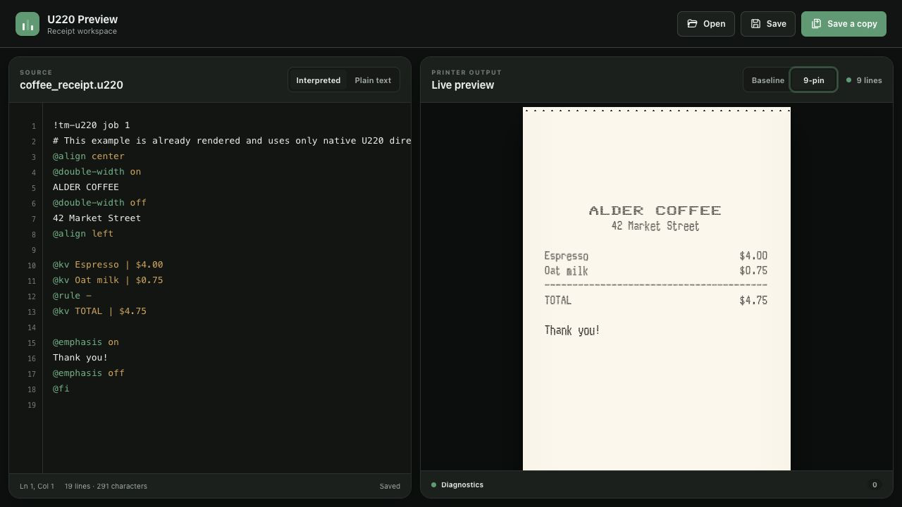

# TM-U220 Formatter

[](LICENSE)


An independent macOS formatter, ESC/POS compiler, and live receipt preview for
network-connected Epson TM-U220 printers. It turns UTF-8 text or a small,
line-oriented receipt language into deterministic printer bytes.

> [!IMPORTANT]
> This is unofficial, independently developed compatibility software. It is
> not affiliated with, endorsed by, sponsored by, or supported by Epson.



The terminal renderer, browser preview, byte compiler, and printer transports
all use the same validated document and physical-printer profile. A printer is
not required to check, compile, render, inspect, or preview a receipt.

## Why I built this

My main goal with this project was to supply the printer with printable text
using simple plain text. I chose to emulate parts of the printer's feature set
as a way to explore and test what the machine can do. The intended workflow is
a plain-text document sprinkled with valid directives, keeping at-home receipt
formatting simple and easy to produce. Generating those documents from actual
application or business data is up to the user to solve; this project begins at
the text-document boundary.

Connectivity was the other big problem. The installation and printer-connection
tools are my best attempt to minimize the annoyances I encountered while trying
to communicate with the machine. They exist primarily as a personal convenience
and have only been exercised on my own Mac. They have automated boundary tests,
but they have not undergone independent security testing. Anyone enabling the
printing paths should review the documented policy and decide whether it is
appropriate for their machine and network.

## Features

- Live source editor with a paper preview and source-linked scrolling
- Deterministic layout for TM-U220 Type A, B, and D profiles
- Exact ESC/POS output with atomic failure: invalid jobs emit no printer bytes
- UTF-8 input mapped through a redistributable standard code-page catalog
- Plain text plus native alignment, font, emphasis, color, table, image, feed,
  and cut directives
- Direct PBM/PNG/JPEG printing with profile-driven sizing, resampling, and
  dithering
- Live image-profile tuning against the exact final printer-dot mask
- Fast whole-job LPD printing, optional checkpointed live printing, and an
  advanced one-shot RAW TCP transport
- Strict inspection, device-query decoding, and per-machine printing policy
- No npm or Lua package dependencies

## Requirements

| | Supported |
| --- | --- |
| Host | macOS, running as a normal non-root user |
| Runtimes | Lua 5.3 or newer and Node.js 20.11 or newer |
| Printers | TM-U220 Type A, B, and D profiles |
| Paper | 76, 69.5, and 57.5 mm where supported by the printer variant |
| Network delivery | LPD, checkpointed live RAW, or advanced one-shot RAW TCP |

USB and serial delivery are not currently exposed as command-line transports.

## Try it without a printer

Clone the repository, then run these commands from its root:

```sh
./bin/tm-u220 check examples/coffee_receipt.u220
./bin/tm-u220 render examples/coffee_receipt.u220
./bin/tm-u220 preview examples/coffee_receipt.u220
```

The first command validates the document, the second renders its receipt plan
in the terminal, and the third opens the live editor shown above. None contacts
a printer.

## Install

The source-checkout installer creates an unprivileged, versioned release under
`~/.local` by default:

```sh
./install/tm-u220 manifest
./install/tm-u220 install
```

Add `~/.local/bin` to `PATH` if necessary. The installed commands are `220` and
`tm-u220-install`.

The installer uses an explicit file allowlist, records the mode, size, and
SHA-256 digest of every installed file, and activates a release atomically. It
does not use `sudo`, configure a printer, or claim publisher signing:

```sh
tm-u220-install version
tm-u220-install inspect
tm-u220-install inspect --json
```

Application removal is a dry run unless explicitly requested. It also refuses
to claim that it removed the separate, root-owned printing policy:

```sh
tm-u220-install uninstall
220 remove-printing --remove
220 printing-status
tm-u220-install uninstall --remove --keep-printing-policy
```

Review the [printing policy](docs/printing-policy.md) before enabling printer
access or removing an installed policy.

## Write a receipt

A job can be ordinary text or a UTF-8 document with native directives:

```text
!tm-u220 job 1
@profile variant=B paper=76 dip2_1=off cutter=partial
@center @bold OPEN CIRCUIT COFFEE
@bold off @left
@kv_start
Espresso | $3.50
Oat milk | $0.75
@kv_end
@rule -
@kv TOTAL | $4.25
@fi
```

The header is optional. The profile may instead come from a checked `.u220p`
file, and both sources must agree when they are present together. See the
[job-format reference](docs/job-format.md) or run:

```sh
220 directives
220 rules directives
```

The [full capability sheet](examples/example.txt) exercises layout and style
commands. The generated [standard-page specimen](examples/chars.txt) exercises
every distributed character-page coordinate.

Common authoring commands are:

```sh
220 check receipt.u220
220 render receipt.u220
220 compile receipt.u220 --hex
220 compile receipt.u220 -o receipt.bin
220 preview receipt.u220
```

Images can be a complete input or a companion inside a receipt:

```sh
220 preview art/chicken.png
220 render art/chicken.png
220 print art/chicken.png
```

For example, `receipt.u220` may contain:

```u220
@image "art/chicken.png" 20 10
```

Then preview or print that receipt normally:

```sh
220 preview receipt.u220
220 print receipt.u220
```

For a one-line formatted job, image paths are relative to the directory where
`220` is invoked:

```sh
220 print '@image "art/chicken.png" 20 10'
```

`@image` is job-language syntax, not a shell command or a `220` subcommand.

Tune how a direct PNG, JPEG, or binary PBM image is interpreted with:

```sh
220 image-profile art/chicken.png
```

The selected image remains fixed and read-only while changes are compiled
through the normal image pipeline into an exact live printer-dot preview.
Revert restores the saved settings; Save or Command-S updates the active image
profile. The editor has no print action and does not contact the printer.

The same versioned image profile is the third tab opened by `220 config`. It
controls default size, fit, resampling, dithering, density, inversion,
registration, and trailing spacing. See the
[printhead image guide](docs/printhead-images.md). JPEG decoding is delegated to
a pinned, bounded decoder shipped with the formatter.

Use `--text` for guaranteed literal input and `--ftext` or
`--formatted-text` for an interpreted string. With no input argument, `check`,
`render`, `compile`, and `print` read interpreted standard input through EOF.

## Live browser preview

```sh
220 preview examples/coffee_receipt.u220
```

The editor recompiles the current buffer through the same Lua formatter used by
the terminal and printer commands. It models compiler-provided run positions,
paper width, line spacing, alignment, feed and reverse-feed motion, styles,
cutter travel, and cut position. Invalid edits leave the last valid receipt
visible and add source-line diagnostics.

Press Command-S to update the source file owned by the preview session;
Shift-Command-S explicitly saves a separate copy. Stopping the command with
Ctrl-C closes the loopback-only server. Browser-opened files are updated only
when the browser grants writable access. The preview cannot print or contact
the printer.

The default 9-pin view uses separately authored, approximate Font A and Font B
strike atlases for printable ASCII plus any page-0 PC437 masks authored in the
checkout-only glyph workspace. Extended slots without an authored mask retain
the browser-backed representative. A profile-calibrated browser-font baseline
is available for comparison. Their release provenance is recorded in
[PROVENANCE.md](docs/PROVENANCE.md).

## Print

Printer access is deliberately separate from application installation. Run the
one-time assistant as the normal account that will print:

```sh
220 setup-printing
220 printing-status
220 printing-status --check-device
```

The assistant binds one account, private or link-local printer address, physical
profile, and narrowly enumerated macOS connection policy. It shows the exact
policy before Apple Installer requests administrator authorization. The
formatter itself remains unprivileged.

Normal printing submits one complete compiled job through LPD:

```sh
220 print receipt.u220
220 print "hello from the printer"
printf '12345\n12345\n@fi' | 220 print
```

Use live mode when confirmed-line mirroring, printer status, and cancellation
are worth the slower checkpointed route:

```sh
220 print receipt.u220 --live
220 print receipt.u220 --live --silent
```

Press `c` or Ctrl-C to cancel before the next operation. LPD acceptance and RAW
submission do not prove that paper moved or a receipt physically printed. The
printer protocols are plaintext and unauthenticated, so use a trusted, isolated
printer network. See [local LPD printing](docs/lpd-printing.md),
[live printing](docs/live-printing.md), and
[advanced RAW TCP printing](docs/raw-tcp-printing.md).

## Command overview

| Command | Purpose |
| --- | --- |
| `220 check INPUT` | Validate without emitting printer bytes |
| `220 render INPUT` | Render the compiled receipt plan in the terminal or JSON |
| `220 compile INPUT` | Write raw ESC/POS bytes or hexadecimal output |
| `220 preview FILE` | Open the live browser editor and preview |
| `220 image-profile IMAGE` | Tune image interpretation against a live printer-dot preview |
| `220 print INPUT` | Compile and submit through the installed printer policy |
| `220 inspect FILE` | Parse and describe an existing byte stream |
| `220 directives` | List the compact native directive and alias reference |
| `220 rules [TOPIC]` | Explain authoring and hardware rules |
| `220 config` | Edit aliases, printer profile, and image profile in Vim |
| `220 profile-queries` | List supported transport-neutral device queries |
| `220 setup-printing` | Review and install the per-machine printing policy |
| `220 printing-status` | Audit the installed policy without network I/O |
| `220 dev glyphs` | Open the checkout-only glyph editor and receipt preview |

Run `220`, `220 help COMMAND`, or `220 COMMAND --help` for focused usage.
The `dev` group is available only from a source checkout; invoke
`./dev/glyphs` directly for its advanced receipt and server options.

## Character data and Epson materials

The public catalog contains standard PC437, PC850, PC860, PC863, PC865,
Windows-1252, PC866, PC852, and PC858 mappings. They are deterministically
generated from pinned Unicode mapping data; exact input hashes and the generator
are documented in [THIRD_PARTY_NOTICES.md](THIRD_PARTY_NOTICES.md).

Only the mappings listed above are supported. An `@code-page` value outside
that public catalog is rejected. Epson manuals, character tables, firmware,
software, logos, and ROM font data are not included in this repository.
External specifications are linked in
[specification sources](docs/spec-sources.md).

## Lua API

The compiler also accepts in-memory jobs:

```lua
package.path = "src/?.lua;src/?/init.lua;" .. package.path

local U220 = require("tm_u220")
local result = U220.compile([[
!tm-u220 job 1
@profile variant=B paper=76 dip2_1=off cutter=partial
Hello from Lua
]])

assert(result.bytes, result.diagnostics[1] and result.diagnostics[1].message)
```

`U220.inspect(bytes)` parses a raw stream. Profile codecs and discovery
definitions are available under `U220.profile`.

## Future directions

Future goals include more complete and accurate font emulation in the browser
preview and, potentially, more powerful formatting rules. Those additions
should preserve the original goal: receipt documents should remain easy to
write, read, and change as plain text.

## Documentation

- [Architecture and trust boundaries](docs/architecture.md)
- [CLI contract](docs/cli-contract.md)
- [Job format](docs/job-format.md)
- [Printing policy and security](docs/printing-policy.md)
- [Why authorization precedes device checking](docs/printing-authorization-rationale.md)
- [Printer settings discovery](docs/printer-settings.md)
- [Printhead image pipeline](docs/printhead-images.md)
- [Local LPD printing](docs/lpd-printing.md)
- [Checkpointed live printing](docs/live-printing.md)
- [Advanced RAW TCP printing](docs/raw-tcp-printing.md)
- [Specification sources](docs/spec-sources.md)
- [Provenance](docs/PROVENANCE.md)

## Tests and contributions

```sh
test/run-all
```

The suite uses injected adapters and temporary local artifacts; it does not
contact printer hardware. GitHub Actions runs the same release gate on macOS.

See [CONTRIBUTING.md](CONTRIBUTING.md) before submitting changes and report
security issues through the private process in [SECURITY.md](SECURITY.md).

## License

Except where otherwise noted, project-authored material in this repository is
licensed under the [MIT License](LICENSE). That license covers only rights held
by the contributors; it does not grant rights in Epson trademarks,
patents, documentation, firmware, or other proprietary materials.

See [NOTICE](NOTICE), [provenance](docs/PROVENANCE.md), and
[third-party notices](THIRD_PARTY_NOTICES.md).
